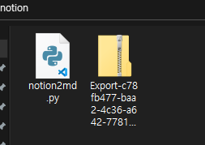
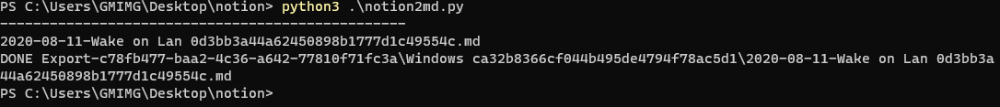
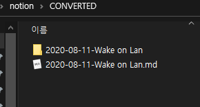

# 2020-08-11-notion2md

# **notion2md**

Automation convert Exported notion markdown(include img, table(csv))



Exported notion markdown zip
(Export format : Markdown & CSV, include subpages : On)



-> .md + images folder



## **Need to**

- 2020 notion
- python3.6 (or higher version)
- Exported zip (Include ????-??-??-* .md)
- powershell (or cmd)

## **How to**

./notion2md.py
./Exprot-*.zip

run

```
./> python3 notion2md
```